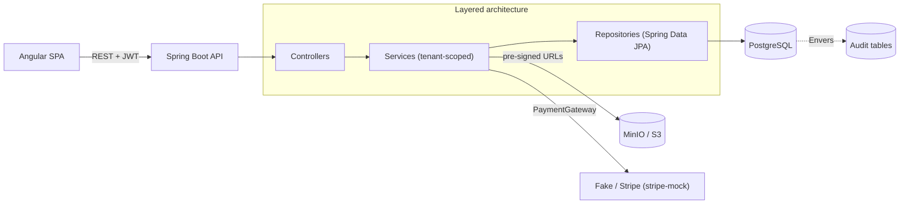
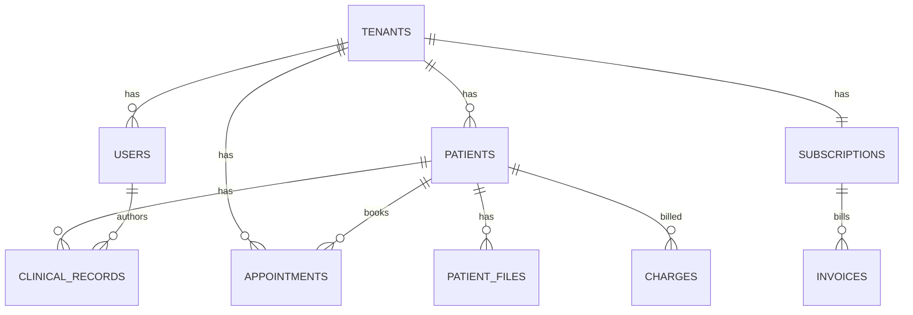

# 🦷 OdontoFlow — Backend

> Multi-tenant SaaS backend for dental clinic management: scheduling, clinical records with an interactive odontogram, radiograph storage, finances, and subscription billing.

**🌐 Language:** **English** · [Português 🇧🇷](README.pt-BR.md)

[](https://github.com/diegodinizm1/odontoflow-back/actions/workflows/ci.yml)


> ℹ️ **Portfolio project.** No real secrets are committed — all credentials are read from environment variables with safe local defaults (see [`.env.example`](.env.example)).

---

## Overview

OdontoFlow is a **B2B multi-tenant** platform that lets a dental clinic run its day-to-day: book appointments, keep patient records and an interactive odontogram, store radiographs securely, track revenue, and manage its own SaaS subscription. Each clinic (tenant) is fully isolated.

This repository is the **REST API** (Spring Boot). The Angular frontend lives in a separate repository.

## Features

**Functional**
- 📊 **Dashboard** — one aggregated overview: patient count, today's agenda, monthly revenue and pending charges.
- 🔐 **Onboarding & Auth** — self-service clinic registration provisioning the founding dentist; JWT login carrying `user_id`, `role` and `tenant_id`.
- 👥 **Patients** — CRUD with phone and anamnesis (allergies, medical alerts), scoped per tenant.
- 📅 **Appointments** — weekly/daily agenda with **overlap prevention** per dentist, reschedule and status changes. **Role-scoped visibility**: dentists only see their own agenda, receptionists see all and can filter by dentist.
- 🛎️ **Service catalogue** — each clinic manages its bookable procedures (name, duration, price); a starter set is seeded on registration. Duration drives the online slot length.
- 🌐 **Online booking (public marketplace)** — a no-auth directory lists every clinic; patients open a clinic, pick a **service** + dentist + free slot and request an appointment. The request lands as `PENDING` and reserves the slot (reusing the overlap check) until the clinic confirms or rejects it; pending requests are surfaced on the dashboard.
- 🦷 **Clinical records & odontogram** — evolution notes signed by the dentist + odontogram state stored as **JSONB** (`{"18": {"condition":"CARIES","surfaces":["O"]}}`).
- 🖼️ **Radiographs** — uploads via **time-limited pre-signed URLs** (S3/MinIO), never exposing the bucket publicly.
- 🗂️ **Treatment plans** — budget with line items (procedure, optional tooth, amount); completing an item auto-generates a pending charge in finances.
- 💰 **Clinic finances** — per-appointment charges (`PENDING`/`PAID`/`CANCELED`) and monthly revenue summary.
- 💳 **Subscription billing** — Free / Essencial / Pro plans with enforced limits, invoices, and a pluggable payment gateway (+ webhook handling).
- 🧑‍⚕️ **Team management** — invite dentists/receptionists, enforced by the plan's dentist limit.

**Non-functional**
- 🏢 **Multi-tenancy** — logical isolation via a `tenant_id` discriminator on every table, enforced at the service layer from the JWT.
- 📜 **Audit trail (LGPD/HIPAA)** — Hibernate Envers mirrors every change to `patients` and `clinical_records`, stamped with the acting user.
- 🔒 **Security** — Spring Security, stateless JWT, BCrypt password hashing, method-level role checks.

## Tech stack

| Area | Technology |
|------|-----------|
| Language / Runtime | Java 17 |
| Framework | Spring Boot 3.5 (Web, Security, Data JPA, Validation) |
| Database | PostgreSQL 15+ · Flyway migrations |
| Auth | JWT (jjwt) · BCrypt |
| Audit | Hibernate Envers |
| Object storage | AWS SDK v2 (S3) → MinIO in dev, pre-signed URLs |
| Payments | stripe-java + `stripe-mock` (pluggable `PaymentGateway`) |
| Docs | springdoc-openapi (Swagger UI) |
| Tests | JUnit 5 · Mockito · Testcontainers |
| Infra | Docker Compose · GitHub Actions CI |

## Architecture



- **Tenant scoping** — `SecurityUtils` reads `tenant_id`/`user_id` from the JWT; every query is filtered by `tenant_id`.
- **Pluggable adapters** — `StorageService` (S3/MinIO) and `PaymentGateway` (Fake/Stripe) are interfaces selected by configuration, so providers swap without touching business logic.
- **Global error handling** — `@RestControllerAdvice` returns a consistent error body (`status`, `error`, `message`, `path`, `timestamp`).

### Data model



## API overview

Base path: `/api` · Interactive docs: **`/api/swagger-ui.html`**

| Method | Endpoint | Description |
|--------|----------|-------------|
| `GET` | `/dashboard` | Aggregated overview (counts, revenue, today's agenda) |
| `GET/POST/PUT/DELETE` | `/services` | Clinic service catalogue (CRUD) |
| `GET` | `/public/clinics` | Directory of all clinics (marketplace, no auth) |
| `GET` | `/public/clinics/{slug}` | Public clinic profile + dentists + services (no auth) |
| `GET` | `/public/clinics/{slug}/availability` | Free slots for a dentist + service on a day (no auth) |
| `POST` | `/public/clinics/{slug}/bookings` | Request an appointment online → `PENDING` (no auth) |
| `POST` | `/auth/tenant` | Register clinic + founding dentist |
| `POST` | `/auth/login` | Authenticate, returns JWT |
| `GET/POST` | `/patients` | List / create patients |
| `GET/PUT/DELETE` | `/patients/{id}` | Read / update / delete patient |
| `GET/POST` | `/patients/{id}/records` | Clinical evolution history / new record |
| `GET` | `/patients/{id}/odontogram` | Latest odontogram state |
| `GET/POST/DELETE` | `/patients/{id}/files` | Radiographs (pre-signed URLs) |
| `GET` | `/patients/{id}/audit` | Change history (audit trail) |
| `GET/POST` | `/appointments` | Agenda (range query, role-scoped + optional `dentistId` filter) / create |
| `PUT/PATCH` | `/appointments/{id}` | Reschedule / change status |
| `GET/POST` | `/patients/{id}/treatment-plans` | Treatment plans / create with items |
| `POST` | `/patients/{id}/treatment-plans/{planId}/items/{itemId}/complete` | Complete item (generates a charge) |
| `GET/POST` | `/charges` · `/charges/summary` | Finances / monthly summary |
| `GET/POST` | `/billing/*` | Plans, subscription, invoices |
| `POST` | `/webhooks/billing` | Payment gateway callbacks |
| `GET/POST/DELETE` | `/users` | Team management |

## Getting started

### Prerequisites
- Java 17+
- Docker & Docker Compose

### Run

```bash
# 1. (optional) configure your own credentials
cp .env.example .env

# 2. start the app — Spring Boot Docker Compose support auto-starts
#    PostgreSQL, MinIO and stripe-mock from compose.yaml
./mvnw spring-boot:run
```

The API is available at `http://localhost:8080/api` and Swagger UI at
`http://localhost:8080/api/swagger-ui.html`. Flyway applies all migrations on startup.

### Run the full stack with Docker (one command)

The whole backend (API + PostgreSQL + MinIO + stripe-mock) runs from the `full` Compose profile — no JDK or Maven needed on your machine:

```bash
docker compose --profile full up --build
```

The API is then served at `http://localhost:8080/api`. (Without the profile, `compose.yaml` starts only the dependencies, which is what `./mvnw spring-boot:run` uses for local development.)

### Configuration

All sensitive settings come from environment variables (with dev defaults). See [`.env.example`](.env.example) — notably `JWT_SECRET` **must** be overridden in production, and `BILLING_PROVIDER` switches between `fake` (offline) and `stripe`.

### Tests

```bash
./mvnw verify      # unit (Surefire) + integration (Failsafe, Testcontainers)
```

Integration tests spin up real PostgreSQL and `stripe-mock` containers via Testcontainers — Docker must be running.

Test coverage is measured with **JaCoCo** (unit + integration): `./mvnw verify` writes an HTML report to `target/site/jacoco/index.html` (~93% line / 81% branch coverage).

## Project structure

```
src/main/java/com/diego/odontoflowbackend
├── config/         # Security, CORS, OpenAPI
├── controller/     # REST endpoints
├── service/        # Business logic (tenant-scoped)
├── repository/     # Spring Data JPA
├── entity/         # JPA entities, enums, DTOs
├── security/       # JWT filter/util, SecurityUtils
├── storage/        # StorageService + S3/MinIO adapter
├── billing/        # PaymentGateway + Fake/Stripe adapters
├── audit/          # Envers revision entity + listener
└── exception/      # Global handler + typed exceptions
src/main/resources/db/migration  # Flyway V1..V8
```

## License

MIT — built as a portfolio project.
