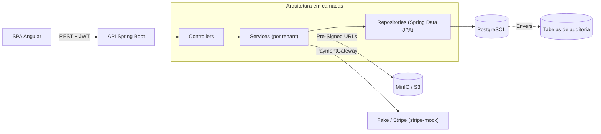
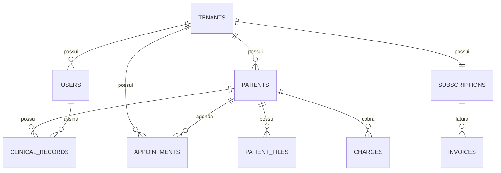

# 🦷 OdontoFlow — Backend

> Backend SaaS multi-tenant para gestão de clínicas odontológicas: agenda, prontuário com odontograma interativo, armazenamento de radiografias, financeiro e assinaturas.

**🌐 Idioma:** [English](README.md) · **Português 🇧🇷**


> ℹ️ **Projeto de portfólio.** Nenhum segredo real é versionado — todas as credenciais vêm de variáveis de ambiente com defaults seguros para dev (veja [`.env.example`](.env.example)).

---

## Visão geral

O OdontoFlow é uma plataforma **B2B multi-tenant** que permite a uma clínica odontológica tocar o dia a dia: agendar consultas, manter prontuários e um odontograma interativo, armazenar radiografias com segurança, acompanhar faturamento e gerenciar a própria assinatura do SaaS. Cada clínica (tenant) é totalmente isolada.

Este repositório é a **API REST** (Spring Boot). O frontend em Angular fica em um repositório separado.

## Funcionalidades

**Funcionais**
- 📊 **Dashboard** — visão geral agregada: total de pacientes, agenda do dia, faturamento do mês e cobranças pendentes.
- 🔐 **Onboarding & Autenticação** — cadastro autônomo da clínica provisionando o dentista fundador; login JWT com `user_id`, `role` e `tenant_id`.
- 👥 **Pacientes** — CRUD com telefone e anamnese (alergias, alertas médicos), isolado por tenant.
- 📅 **Agenda** — visão semanal/diária com **prevenção de sobreposição** por dentista, reagendamento e mudança de status.
- 🦷 **Prontuário & odontograma** — evoluções assinadas pelo dentista + estado do odontograma em **JSONB** (`{"18": {"condition":"CARIES","surfaces":["O"]}}`).
- 🖼️ **Radiografias** — upload via **Pre-Signed URLs temporárias** (S3/MinIO), sem expor o bucket publicamente.
- 🗂️ **Planos de tratamento** — orçamento com itens (procedimento, dente opcional, valor); ao concluir um item, gera automaticamente uma cobrança pendente no financeiro.
- 💰 **Financeiro da clínica** — cobranças por consulta (`PENDENTE`/`PAGO`/`CANCELADO`) e resumo mensal de faturamento.
- 💳 **Assinaturas** — planos Grátis / Essencial / Pro com limites aplicados, faturas e gateway de pagamento plugável (+ webhook).
- 🧑‍⚕️ **Gestão de equipe** — convite de dentistas/recepcionistas, respeitando o limite de dentistas do plano.

**Não-funcionais**
- 🏢 **Multi-tenancy** — isolamento lógico via coluna `tenant_id` em todas as tabelas, aplicado na camada de serviço a partir do JWT.
- 📜 **Trilha de auditoria (LGPD/HIPAA)** — Hibernate Envers espelha toda alteração em `patients` e `clinical_records`, carimbada com o usuário responsável.
- 🔒 **Segurança** — Spring Security, JWT stateless, hashing de senha com BCrypt, checagem de papel por método.

## Stack

| Área | Tecnologia |
|------|-----------|
| Linguagem / Runtime | Java 17 |
| Framework | Spring Boot 3.5 (Web, Security, Data JPA, Validation) |
| Banco | PostgreSQL 15+ · migrações Flyway |
| Auth | JWT (jjwt) · BCrypt |
| Auditoria | Hibernate Envers |
| Armazenamento | AWS SDK v2 (S3) → MinIO em dev, Pre-Signed URLs |
| Pagamentos | stripe-java + `stripe-mock` (`PaymentGateway` plugável) |
| Docs | springdoc-openapi (Swagger UI) |
| Testes | JUnit 5 · Mockito · Testcontainers |
| Infra | Docker Compose · GitHub Actions CI |

## Arquitetura



- **Isolamento por tenant** — `SecurityUtils` lê `tenant_id`/`user_id` do JWT; toda consulta é filtrada por `tenant_id`.
- **Adaptadores plugáveis** — `StorageService` (S3/MinIO) e `PaymentGateway` (Fake/Stripe) são interfaces escolhidas por configuração; trocar de provedor não mexe na regra de negócio.
- **Tratamento de erros global** — `@RestControllerAdvice` devolve um corpo de erro consistente (`status`, `error`, `message`, `path`, `timestamp`).

### Modelo de dados



## Visão da API

Base: `/api` · Documentação interativa: **`/api/swagger-ui.html`**

| Método | Endpoint | Descrição |
|--------|----------|-----------|
| `GET` | `/dashboard` | Visão geral agregada (contagens, faturamento, agenda do dia) |
| `POST` | `/auth/tenant` | Registrar clínica + dentista fundador |
| `POST` | `/auth/login` | Autenticar, retorna JWT |
| `GET/POST` | `/patients` | Listar / criar pacientes |
| `GET/PUT/DELETE` | `/patients/{id}` | Ler / atualizar / remover paciente |
| `GET/POST` | `/patients/{id}/records` | Histórico de evolução / nova evolução |
| `GET` | `/patients/{id}/odontogram` | Estado atual do odontograma |
| `GET/POST/DELETE` | `/patients/{id}/files` | Radiografias (Pre-Signed URLs) |
| `GET` | `/patients/{id}/audit` | Histórico de alterações (auditoria) |
| `GET/POST` | `/appointments` | Agenda (consulta por intervalo) / criar |
| `PUT/PATCH` | `/appointments/{id}` | Reagendar / mudar status |
| `GET/POST` | `/patients/{id}/treatment-plans` | Planos de tratamento / criar com itens |
| `POST` | `/patients/{id}/treatment-plans/{planId}/items/{itemId}/complete` | Concluir item (gera cobrança) |
| `GET/POST` | `/charges` · `/charges/summary` | Financeiro / resumo mensal |
| `GET/POST` | `/billing/*` | Planos, assinatura, faturas |
| `POST` | `/webhooks/billing` | Callbacks do gateway de pagamento |
| `GET/POST/DELETE` | `/users` | Gestão de equipe |

## Como rodar

### Pré-requisitos
- Java 17+
- Docker & Docker Compose

### Execução

```bash
# 1. (opcional) configure suas credenciais
cp .env.example .env

# 2. suba a aplicação — o suporte a Docker Compose do Spring Boot
#    inicia PostgreSQL, MinIO e stripe-mock do compose.yaml automaticamente
./mvnw spring-boot:run
```

A API fica em `http://localhost:8080/api` e o Swagger UI em
`http://localhost:8080/api/swagger-ui.html`. O Flyway aplica as migrações no startup.

### Rodar a stack completa com Docker (um comando)

Todo o backend (API + PostgreSQL + MinIO + stripe-mock) sobe pelo profile `full` do Compose — sem precisar de JDK ou Maven na máquina:

```bash
docker compose --profile full up --build
```

A API fica em `http://localhost:8080/api`. (Sem o profile, o `compose.yaml` sobe apenas as dependências, que é o que o `./mvnw spring-boot:run` usa no desenvolvimento local.)

### Configuração

Tudo que é sensível vem de variáveis de ambiente (com defaults de dev). Veja [`.env.example`](.env.example) — em especial `JWT_SECRET` **deve** ser sobrescrito em produção, e `BILLING_PROVIDER` alterna entre `fake` (offline) e `stripe`.

### Testes

```bash
./mvnw verify      # unitários (Surefire) + integração (Failsafe, Testcontainers)
```

Os testes de integração sobem containers reais de PostgreSQL e `stripe-mock` via Testcontainers — o Docker precisa estar rodando.

A cobertura é medida com **JaCoCo** (unit + integração): `./mvnw verify` gera um relatório HTML em `target/site/jacoco/index.html` (~93% de linhas / 81% de branches).

## Estrutura do projeto

```
src/main/java/com/diego/odontoflowbackend
├── config/         # Security, CORS, OpenAPI
├── controller/     # Endpoints REST
├── service/        # Regra de negócio (por tenant)
├── repository/     # Spring Data JPA
├── entity/         # Entidades JPA, enums, DTOs
├── security/       # Filtro/util JWT, SecurityUtils
├── storage/        # StorageService + adaptador S3/MinIO
├── billing/        # PaymentGateway + adaptadores Fake/Stripe
├── audit/          # Entidade de revisão Envers + listener
└── exception/      # Handler global + exceções tipadas
src/main/resources/db/migration  # Flyway V1..V8
```

## Licença

MIT — feito como projeto de portfólio.
